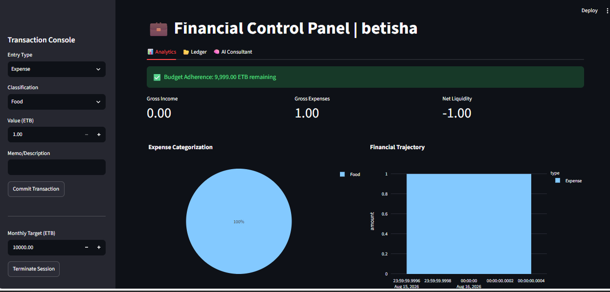

# 💰 Intelligent Finance Suite - AI Powered

A comprehensive personal finance management system built with **Python**, **Streamlit**, and **Llama 3.3 (via Groq API)**. Features secure user authentication, interactive data visualization, and AI-driven financial advice.

## 📸 Dashboard Preview

## 🌟 Key Features
- **Secure Authentication:** User registration and login system with password encryption (SHA-256).
- **Financial Analytics:** Interactive charts using **Plotly** to track spending patterns and income trends.
- **AI Financial Consultant:** Personalized saving strategies and insights powered by Llama 3.3.
- **Budget Management:** Set monthly limits and receive real-time budget adherence alerts.
- **Data Export:** Export transaction history to CSV format for external use.

## 🛠️ Tech Stack
- **Frontend:** Streamlit
- **Backend:** Python 3.13, SQLite
- **AI Engine:** Groq Cloud API
- **Visuals:** Plotly Express

---
### 👤 Author
- **Betelhem Kefelegn**
- 4th Year Software Engineering Student